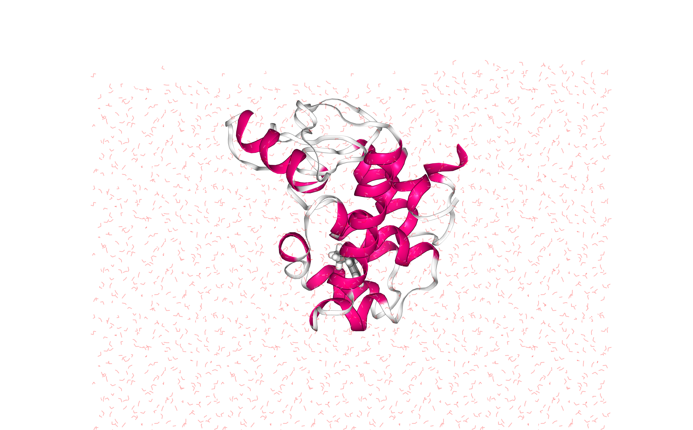
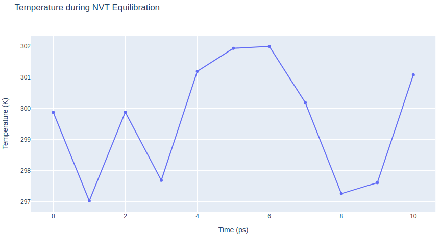

# Protein Ligand Complex MD Setup tutorial using BioExcel Building Blocks (biobb)
### Based on the official Gromacs tutorial: http://www.mdtutorials.com/gmx/complex/index.html
***
This tutorial aims to illustrate the process of **setting up a simulation system** containing a **protein in complex with a ligand**, step by step, using the **BioExcel Building Blocks library (biobb)**. The particular example used is the **T4 lysozyme** L99A/M102Q protein (PDB code 3HTB, [https://doi.org/10.2210/pdb3HTB/pdb](https://doi.org/10.2210/pdb3HTB/pdb)), in complex with the **2-propylphenol** small molecule (3-letter Code JZ4, [https://www.rcsb.org/ligand/JZ4](https://www.rcsb.org/ligand/JZ4)). 
***
**Biobb modules** used:

 - [biobb_io](https://github.com/bioexcel/biobb_io): Tools to fetch biomolecular data from public databases.
 - [biobb_model](https://github.com/bioexcel/biobb_model): Tools to model macromolecular structures.
 - [biobb_chemistry](https://github.com/bioexcel/biobb_chemistry): Tools to manipulate chemical data.
 - [biobb_gromacs](https://github.com/bioexcel/biobb_gromacs): Tools to setup and run Molecular Dynamics simulations.
 - [biobb_analysis](https://github.com/bioexcel/biobb_analysis): Tools to analyse Molecular Dynamics trajectories.
 - [biobb_structure_utils](https://github.com/bioexcel/biobb_structure_utils):  Tools to modify or extract information from a PDB structure file.
 
### Auxiliary libraries used

* [jupyter](https://jupyter.org/): Free software, open standards, and web services for interactive computing across all programming languages.
* [nglview](http://nglviewer.org/#nglview): Jupyter/IPython widget to interactively view molecular structures and trajectories in notebooks.
* [plotly](https://plot.ly/python/offline/): Python interactive graphing library integrated in Jupyter notebooks.
* [simpletraj](https://github.com/arose/simpletraj): Lightweight coordinate-only trajectory reader based on code from GROMACS, MDAnalysis and VMD.

### Conda Installation and Launch

```console
git clone https://github.com/bioexcel/biobb_wf_protein-complex_md_setup.git
cd biobb_wf_protein-complex_md_setup
conda env create -f conda_env/environment.yml
conda activate biobb_wf_protein-complex_md_setup
jupyter-notebook biobb_wf_protein-complex_md_setup/notebooks/biobb_wf_protein-complex_md_setup.ipynb
```

***
### Pipeline steps:
 1. [Input Parameters](#input)
 2. [Fetching PDB Structure](#fetch)
 3. [Fix Protein Structure](#fix)
 4. [Create Protein System Topology](#top)
 5. [Create ligand system topology](#ligtop)
 6. [Preparing Ligand Restraints](#restraints)
 7. [Create new protein-ligand complex structure file](#complex)
 8. [Create new protein-ligand complex topology file](#complextop)
 9. [Create Solvent Box](#box)
 10. [Fill the Box with Water Molecules](#water)
 11. [Adding Ions](#ions)
 12. [Energetically Minimize the System](#min)
 13. [Equilibrate the System (NVT)](#nvt)
 14. [Equilibrate the System (NPT)](#npt)
 15. [Free Molecular Dynamics Simulation](#free)
 16. [Post-processing and Visualizing Resulting 3D Trajectory](#post)
 17. [Output Files](#output)
 18. [Questions & Comments](#questions)
 
***
***

***


## Initializing colab
The two cells below are used only in case this notebook is executed via **Google Colab**. Take into account that, for running conda on **Google Colab**, the **condacolab** library must be installed. As [explained here](https://pypi.org/project/condacolab/), the installation requires a **kernel restart**, so when running this notebook in **Google Colab**, don't run all cells until this **installation** is properly **finished** and the **kernel** has **restarted**.


```python
# Only executed when using google colab
import sys
if 'google.colab' in sys.modules:
  import subprocess
  from pathlib import Path
  try:
    subprocess.run(["conda", "-V"], check=True)
  except FileNotFoundError:
    subprocess.run([sys.executable, "-m", "pip", "install", "condacolab"], check=True)
    import condacolab
    condacolab.install()
    # Clone repository
    repo_URL = "https://github.com/bioexcel/biobb_wf_protein-complex_md_setup.git"
    repo_name = Path(repo_URL).name.split('.')[0]
    if not Path(repo_name).exists():
      subprocess.run(["mamba", "install", "-y", "git"], check=True)
      subprocess.run(["git", "clone", repo_URL], check=True)
      print("⏬ Repository properly cloned.")
    # Install environment
    print("⏳ Creating environment...")
    env_file_path = f"{repo_name}/conda_env/environment.yml"
    subprocess.run(["mamba", "env", "update", "-n", "base", "-f", env_file_path], check=True)
    print("🎨 Install NGLView dependencies...")
    subprocess.run(["mamba", "install", "-y", "-c", "conda-forge", "nglview==3.0.8", "ipywidgets=7.7.2"], check=True)
    print("👍 Conda environment successfully created and updated.")
```


```python
# Enable widgets for colab
if 'google.colab' in sys.modules:
  from google.colab import output
  output.enable_custom_widget_manager()
  import os
  os.chdir("biobb_wf_protein-complex_md_setup/biobb_wf_protein-complex_md_setup/notebooks")
  print(f"📂 New working directory: {os.getcwd()}")
```

<a id="input"></a>
## Input parameters
**Input parameters** needed:
 - **pdbCode**: PDB code of the protein-ligand complex structure (e.g. 3HTB, [https://doi.org/10.2210/pdb3HTB/pdb](https://doi.org/10.2210/pdb3HTB/pdb))
 - **ligandCode**: Small molecule 3-letter code for the ligand structure (e.g. JZ4, [https://www.rcsb.org/ligand/JZ4](https://www.rcsb.org/ligand/JZ4))
 - **mol_charge**: Charge of the small molecule, needed to add hydrogen atoms.


```python
import nglview
import ipywidgets
import os
import zipfile
import sys

pdbCode = "3HTB"
ligandCode = "JZ4"
mol_charge = 0
```

<a id="fetch"></a>
***
## Fetching PDB structure
Downloading **PDB structure** with the **protein-ligand complex** from the RCSB PDB database.<br>
Alternatively, a PDB file can be used as starting structure. <br>
Splitting the molecule in **three different files**: 
- **proteinFile**: Protein structure
- **ligandFile**: Ligand structure
- **complexFile**: Protein-ligand complex structure 

***
**Building Blocks** used:
 - [Pdb](https://biobb-io.readthedocs.io/en/latest/api.html#module-api.pdb) from **biobb_io.api.pdb**
 - [ExtractHeteroAtoms](https://biobb-structure-utils.readthedocs.io/en/latest/utils.html#module-utils.extract_heteroatoms) from **biobb_structure_utils.utils.extract_heteroatoms**
 - [ExtractMolecule](https://biobb-structure-utils.readthedocs.io/en/latest/utils.html#module-utils.extract_molecule) from **biobb_structure_utils.utils.extract_molecule**
 - [CatPDB](https://biobb-structure-utils.readthedocs.io/en/latest/utils.html#module-utils.cat_pdb) from **biobb_structure_utils.utils.cat_pdb**
***


```python
# Downloading desired PDB file 
# Import module
from biobb_io.api.pdb import pdb

# Create properties dict and inputs/outputs
downloaded_pdb = pdbCode+'.orig.pdb'
prop = {
    'pdb_code': pdbCode,
    'filter': False
}

# Create and launch bb
pdb(output_pdb_path=downloaded_pdb,
    properties=prop)
```


```python
# Extracting Protein, Ligand and Protein-Ligand Complex to three different files
# Import module
from biobb_structure_utils.utils.extract_heteroatoms import extract_heteroatoms
from biobb_structure_utils.utils.extract_molecule import extract_molecule
from biobb_structure_utils.utils.cat_pdb import cat_pdb

# Create properties dict and inputs/outputs
proteinFile = pdbCode+'.pdb'
ligandFile = ligandCode+'.pdb'
complexFile = pdbCode+'_'+ligandCode+'.pdb'

prop = {
     'heteroatoms' : [{"name": "JZ4"}]
}

extract_heteroatoms(input_structure_path=downloaded_pdb,
     output_heteroatom_path=ligandFile,
     properties=prop)

extract_molecule(input_structure_path=downloaded_pdb,
     output_molecule_path=proteinFile)

print(proteinFile, ligandFile, complexFile)

cat_pdb(input_structure1=proteinFile,
       input_structure2=ligandFile,
       output_structure_path=complexFile)
```

### Visualizing 3D structures
Visualizing the generated **PDB structures** using **NGL**:  
- **Protein structure** (Left)
- **Ligand structure** (Center)
- **Protein-ligand complex** (Right)  


```python
# Show structures: protein, ligand and protein-ligand complex
view1 = nglview.show_structure_file(proteinFile)
view1._remote_call('setSize', target='Widget', args=['350px','400px'])
view1.camera='orthographic'
view1
view2 = nglview.show_structure_file(ligandFile)
view2.add_representation(repr_type='ball+stick')
view2._remote_call('setSize', target='Widget', args=['350px','400px'])
view2.camera='orthographic'
view2
view3 = nglview.show_structure_file(complexFile)
view3.add_representation(repr_type='licorice', radius='.5', selection=ligandCode)
view3._remote_call('setSize', target='Widget', args=['350px','400px'])
view3.camera='orthographic'
view3
ipywidgets.HBox([view1, view2, view3])
```

</img></img></img>

<a id="fix"></a>
***
## Fix protein structure
**Checking** and **fixing** (if needed) the protein structure:<br>
- **Modeling** **missing side-chain atoms**, modifying incorrect **amide assignments**, choosing **alternative locations**.<br>
- **Checking** for missing **backbone atoms**, **heteroatoms**, **modified residues** and possible **atomic clashes**.

***
**Building Blocks** used:
 - [FixSideChain](https://biobb-model.readthedocs.io/en/latest/model.html#module-model.fix_side_chain) from **biobb_model.model.fix_side_chain**
***


```python
# Check & Fix Protein Structure
# Import module
from biobb_model.model.fix_side_chain import fix_side_chain

# Create prop dict and inputs/outputs
fixed_pdb = pdbCode+'_fixed.pdb'

# Create and launch bb
fix_side_chain(input_pdb_path=proteinFile,
             output_pdb_path=fixed_pdb)
```

<a id="top"></a>
***
## Create protein system topology
**Building GROMACS topology** corresponding to the protein structure.<br>
Force field used in this tutorial is [**amber99sb-ildn**](https://dx.doi.org/10.1002%2Fprot.22711): AMBER **parm99** force field with **corrections on backbone** (sb) and **side-chain torsion potentials** (ildn). Water molecules type used in this tutorial is [**spc/e**](https://pubs.acs.org/doi/abs/10.1021/j100308a038).<br>
Adding **hydrogen atoms** if missing. Automatically identifying **disulfide bridges**. <br>

Generating two output files: 
- **GROMACS structure** (gro file)
- **GROMACS topology** ZIP compressed file containing:
    - *GROMACS topology top file* (top file)
    - *GROMACS position restraint file/s* (itp file/s)
***
**Building Blocks** used:
 - [Pdb2gmx](https://biobb-md.readthedocs.io/en/latest/gromacs.html#module-gromacs.pdb2gmx) from **biobb_gromacs.gromacs.pdb2gmx**
***


```python
# Create Protein system topology
# Import module
from biobb_gromacs.gromacs.pdb2gmx import pdb2gmx

# Create inputs/outputs
output_pdb2gmx_gro = pdbCode+'_pdb2gmx.gro'
output_pdb2gmx_top_zip = pdbCode+'_pdb2gmx_top.zip'
prop = {
    'force_field' : 'amber99sb-ildn',
    'water_type': 'spce'
}

# Create and launch bb
pdb2gmx(input_pdb_path=fixed_pdb,
        output_gro_path=output_pdb2gmx_gro,
        output_top_zip_path=output_pdb2gmx_top_zip,
        properties=prop)
```

<a id="ligtop"></a>
***
## Create ligand system topology
**Building GROMACS topology** corresponding to the ligand structure.<br>
Force field used in this tutorial step is **amberGAFF**: [General AMBER Force Field](http://ambermd.org/antechamber/gaff.html), designed for rational drug design.<br>
- [Step 1](#ligandTopologyStep1): Add **hydrogen atoms** if missing.
- [Step 2](#ligandTopologyStep2): **Energetically minimize the system** with the new hydrogen atoms. 
- [Step 3](#ligandTopologyStep3): Generate **ligand topology** (parameters). 
***
**Building Blocks** used:
 - [ReduceAddHydrogens](https://biobb-chemistry.readthedocs.io/en/latest/ambertools.html#module-ambertools.reduce_add_hydrogens) from **biobb_chemistry.ambertools.reduce_add_hydrogens**
 - [BabelMinimize](https://biobb-chemistry.readthedocs.io/en/latest/babelm.html#module-babelm.babel_minimize) from **biobb_chemistry.babelm.babel_minimize** 
 - [AcpypeParamsGMX](https://biobb-chemistry.readthedocs.io/en/latest/acpype.html#module-acpype.acpype_params_gmx) from **biobb_chemistry.acpype.acpype_params_gmx** 
***

<a id="ligandTopologyStep1"></a>
### Step 1: Add **hydrogen atoms**


```python
# Create Ligand system topology, STEP 1
# Reduce_add_hydrogens: add Hydrogen atoms to a small molecule (using Reduce tool from Ambertools package)
# Import module
from biobb_chemistry.ambertools.reduce_add_hydrogens import reduce_add_hydrogens

# Create prop dict and inputs/outputs
output_reduce_h = ligandCode+'.reduce.H.pdb' 
prop = {
    'nuclear' : 'true'
}

# Create and launch bb
reduce_add_hydrogens(input_path=ligandFile,
                   output_path=output_reduce_h,
                   properties=prop)

```

<a id="ligandTopologyStep2"></a>
### Step 2: **Energetically minimize the system** with the new hydrogen atoms. 


```python
# Create Ligand system topology, STEP 2
# Babel_minimize: Structure energy minimization of a small molecule after being modified adding hydrogen atoms
# Import module
from biobb_chemistry.babelm.babel_minimize import babel_minimize

# Create prop dict and inputs/outputs
output_babel_min = ligandCode+'.H.min.mol2'                              
prop = {
    'method' : 'sd',
    'criteria' : '1e-10',
    'force_field' : 'GAFF'
}


# Create and launch bb
babel_minimize(input_path=output_reduce_h,
              output_path=output_babel_min,
              properties=prop)
```

### Visualizing 3D structures
Visualizing the small molecule generated **PDB structures** using **NGL**:  
- **Original Ligand Structure** (Left)
- **Ligand Structure with hydrogen atoms added** (with Reduce program) (Center)
- **Ligand Structure with hydrogen atoms added** (with Reduce program), **energy minimized** (with Open Babel) (Right) 


```python
# Show different structures generated (for comparison)

view1 = nglview.show_structure_file(ligandFile)
view1.add_representation(repr_type='ball+stick')
view1._remote_call('setSize', target='Widget', args=['350px','400px'])
view1.camera='orthographic'
view1
view2 = nglview.show_structure_file(output_reduce_h)
view2.add_representation(repr_type='ball+stick')
view2._remote_call('setSize', target='Widget', args=['350px','400px'])
view2.camera='orthographic'
view2
view3 = nglview.show_structure_file(output_babel_min)
view3.add_representation(repr_type='ball+stick')
view3._remote_call('setSize', target='Widget', args=['350px','400px'])
view3.camera='orthographic'
view3
ipywidgets.HBox([view1, view2, view3])
```

</img></img></img>

<a id="ligandTopologyStep3"></a>
### Step 3: Generate **ligand topology** (parameters).


```python
# Create Ligand system topology, STEP 3
# Acpype_params_gmx: Generation of topologies for GROMACS with ACPype
# Import module
from biobb_chemistry.acpype.acpype_params_gmx import acpype_params_gmx

# Create prop dict and inputs/outputs
output_acpype_gro = ligandCode+'params.gro'
output_acpype_itp = ligandCode+'params.itp'
output_acpype_top = ligandCode+'params.top'
output_acpype = ligandCode+'params'
prop = {
    'basename' : output_acpype,
    'charge' : mol_charge
}

# Create and launch bb
acpype_params_gmx(input_path=output_babel_min, 
                output_path_gro=output_acpype_gro,
                output_path_itp=output_acpype_itp,
                output_path_top=output_acpype_top,
                properties=prop)
```

<a id="restraints"></a>
***
## Preparing Ligand Restraints
In subsequent steps of the pipeline, such as the equilibration stages of the **protein-ligand complex** system, it is recommended to apply some **restraints** to the small molecule, to avoid a possible change in position due to protein repulsion. **Position restraints** will be applied to the ligand, using a **force constant of 1000 KJ/mol\*nm^2** on the three coordinates: x, y and z. In this steps the **restriction files** will be created and integrated in the **ligand topology**.
- [Step 1](#restraintsStep1): Creating an index file with a new group including just the **small molecule heavy atoms**.
- [Step 2](#restraintsStep2): Generating the **position restraints** file.
***
**Building Blocks** used:
 - [MakeNdx](https://biobb-md.readthedocs.io/en/latest/gromacs.html#module-gromacs.make_ndx) from **biobb_gromacs.gromacs.make_ndx** 
 - [Genrestr](https://biobb-md.readthedocs.io/en/latest/gromacs.html#module-gromacs.genrestr) from **biobb_gromacs.gromacs.genrestr** 
***

<a id="restraintsStep1"></a>
### Step 1: Creating an index file for the small molecule heavy atoms


```python
# MakeNdx: Creating index file with a new group (small molecule heavy atoms)
from biobb_gromacs.gromacs.make_ndx import make_ndx

# Create prop dict and inputs/outputs
output_ligand_ndx = ligandCode+'_index.ndx'
prop = {
    'selection': "0 & ! a H*"
}

# Create and launch bb
make_ndx(input_structure_path=output_acpype_gro,
        output_ndx_path=output_ligand_ndx,
        properties=prop)
```

<a id="restraintsStep2"></a>
### Step 2: Generating the position restraints file


```python
# Genrestr: Generating the position restraints file
from biobb_gromacs.gromacs.genrestr import genrestr

# Create prop dict and inputs/outputs
output_restraints_top = ligandCode+'_posres.itp'
prop = {
    'force_constants': "1000 1000 1000",
    'restrained_group': "System_&_!H*"
}

# Create and launch bb
genrestr(input_structure_path=output_acpype_gro,
         input_ndx_path=output_ligand_ndx,
         output_itp_path=output_restraints_top,
         properties=prop)
```

<a id="complex"></a>
***
## Create new protein-ligand complex structure file
Building new **protein-ligand complex** PDB file with:
- The new **protein system** with fixed problems from *Fix Protein Structure* step and hydrogens atoms added from *Create Protein System Topology* step.
- The new **ligand system** with hydrogens atoms added from *Create Ligand System Topology* step. 

This new structure is needed for **GROMACS** as it is **force field-compliant**, it **has all the new hydrogen atoms**, and the **atom names are matching the newly generated protein and ligand topologies**.
***
**Building Blocks** used:
 - [GMXTrjConvStr](https://biobb-analysis.readthedocs.io/en/latest/gromacs.html#module-gromacs.gmx_trjconv_str) from **biobb_analysis.gromacs.gmx_trjconv_str**
 - [CatPDB](https://biobb-structure-utils.readthedocs.io/en/latest/utils.html#module-utils.cat_pdb) from **biobb_structure_utils.utils.cat_pdb**
***


```python
# biobb analysis module
from biobb_analysis.gromacs.gmx_trjconv_str import gmx_trjconv_str
from biobb_structure_utils.utils.cat_pdb import cat_pdb

# Convert gro (with hydrogens) to pdb (PROTEIN)
proteinFile_H = pdbCode+'_'+ligandCode+'_complex_H.pdb'
prop = {
    'selection' : 'System'
}

# Create and launch bb
gmx_trjconv_str(input_structure_path=output_pdb2gmx_gro,
              input_top_path=output_pdb2gmx_gro,
              output_str_path=proteinFile_H, 
              properties=prop)

# Convert gro (with hydrogens) to pdb (LIGAND)
ligandFile_H = ligandCode+'_complex_H.pdb'
prop = {
    'selection' : 'System'
}

# Create and launch bb
gmx_trjconv_str(input_structure_path=output_acpype_gro,
              input_top_path=output_acpype_gro,
              output_str_path=ligandFile_H, 
              properties=prop)


# Concatenating both PDB files: Protein + Ligand
complexFile_H = pdbCode+'_'+ligandCode+'_H.pdb'

# Create and launch bb
cat_pdb(input_structure1=proteinFile_H,
       input_structure2=ligandFile_H,
       output_structure_path=complexFile_H)
```

<a id="complextop"></a>
***
## Create new protein-ligand complex topology file
Building new **protein-ligand complex** GROMACS topology file with:
- The new **protein system** topology generated from *Create Protein System Topology* step.
- The new **ligand system** topology generated from *Create Ligand System Topology* step. 

NOTE: From this point on, the **protein-ligand complex structure and topology** generated can be used in a regular MD setup.
***
**Building Blocks** used:
 - [AppendLigand](https://biobb-gromacs.readthedocs.io/en/latest/gromacs_extra.html#gromacs-extra-append-ligand-module) from **biobb_gromacs.gromacs_extra.append_ligand**
***


```python
# AppendLigand: Append a ligand to a GROMACS topology
# Import module
from biobb_gromacs.gromacs_extra.append_ligand import append_ligand

# Create prop dict and inputs/outputs
output_complex_top = pdbCode+'_'+ligandCode+'_complex.top.zip'

posresifdef = "POSRES_"+ligandCode.upper()
prop = {
    'posres_name': posresifdef
}

# Create and launch bb
append_ligand(input_top_zip_path=output_pdb2gmx_top_zip,
             input_posres_itp_path=output_restraints_top,
             input_itp_path=output_acpype_itp, 
             output_top_zip_path=output_complex_top,
             properties=prop)
```

<a id="box"></a>
***
## Create solvent box
Define the unit cell for the **protein-ligand complex** to fill it with water molecules.<br>
**Truncated octahedron** box is used for the unit cell. This box type is the one which best reflects the geometry of the solute/protein, in this case a **globular protein**, as it approximates a sphere. It is also convenient for the computational point of view, as it accumulates **less water molecules at the corners**, reducing the final number of water molecules in the system and making the simulation run faster.<br> A **protein to box** distance of **0.8 nm** is used, and the protein is **centered in the box**.  

***
**Building Blocks** used:
 - [Editconf](https://biobb-md.readthedocs.io/en/latest/gromacs.html#module-gromacs.editconf) from **biobb_gromacs.gromacs.editconf** 
***


```python
# Editconf: Create solvent box
# Import module
from biobb_gromacs.gromacs.editconf import editconf

# Create prop dict and inputs/outputs
output_editconf_gro = pdbCode+'_'+ligandCode+'_complex_editconf.gro'

prop = {
    'box_type': 'octahedron',
    'distance_to_molecule': 0.8
}

# Create and launch bb
editconf(input_gro_path=complexFile_H, 
         output_gro_path=output_editconf_gro,
         properties=prop)
```

<a id="water"></a>
***
## Fill the box with water molecules
Fill the unit cell for the **protein-ligand complex** with water molecules.<br>
The solvent type used is the default **Simple Point Charge water (SPC)**, a generic equilibrated 3-point solvent model. 

***
**Building Blocks** used:
 - [Solvate](https://biobb-md.readthedocs.io/en/latest/gromacs.html#module-gromacs.solvate) from **biobb_gromacs.gromacs.solvate** 
***


```python
# Solvate: Fill the box with water molecules
from biobb_gromacs.gromacs.solvate import solvate

# Create prop dict and inputs/outputs
output_solvate_gro = pdbCode+'_'+ligandCode+'_solvate.gro'
output_solvate_top_zip = pdbCode+'_'+ligandCode+'_solvate_top.zip'

# Create and launch bb
solvate(input_solute_gro_path=output_editconf_gro,
        output_gro_path=output_solvate_gro,
        input_top_zip_path=output_complex_top,
        output_top_zip_path=output_solvate_top_zip)
```

### Visualizing 3D structure
Visualizing the **protein-ligand complex** with the newly added **solvent box** using **NGL**<br>
Note the **octahedral box** filled with **water molecules** surrounding the **protein structure**, which is **centered** right in the middle of the box.


```python
#Show protein
view = nglview.show_structure_file(output_solvate_gro)
view.clear_representations()
view.add_representation(repr_type='cartoon', selection='protein', color='sstruc')
view.add_representation(repr_type='licorice', radius='.5', selection=ligandCode)
view.add_representation(repr_type='line', linewidth='1', selection='SOL', opacity='.3')
view._remote_call('setSize', target='Widget', args=['','600px'])
view.camera='orthographic'
view
```

</img>

<a id="ions"></a>
***
## Adding ions
Add ions to neutralize the **protein-ligand complex** and reach a desired ionic concentration.
- [Step 1](#ionsStep1): Creating portable binary run file for ion generation
- [Step 2](#ionsStep2): Adding ions to **neutralize** the system and reach a **0.05 molar ionic concentration**
***
**Building Blocks** used:
 - [Grompp](https://biobb-md.readthedocs.io/en/latest/gromacs.html#module-gromacs.grompp) from **biobb_gromacs.gromacs.grompp** 
 - [Genion](https://biobb-md.readthedocs.io/en/latest/gromacs.html#module-gromacs.genion) from **biobb_gromacs.gromacs.genion** 
***

<a id="ionsStep1"></a>
### Step 1: Creating portable binary run file for ion generation


```python
# Grompp: Creating portable binary run file for ion generation
from biobb_gromacs.gromacs.grompp import grompp

# Create prop dict and inputs/outputs
prop = {
    'mdp':{
        'nsteps':'5000'
    },
    'simulation_type':'ions',
    'maxwarn': 1
}
output_gppion_tpr = pdbCode+'_'+ligandCode+'_complex_gppion.tpr'

# Create and launch bb
grompp(input_gro_path=output_solvate_gro,
       input_top_zip_path=output_solvate_top_zip, 
       output_tpr_path=output_gppion_tpr,
       properties=prop)
```

<a id="ionsStep2"></a>
### Step 2: Adding ions to neutralize the system
Replace **solvent molecules** with **ions** to **neutralize** the system.


```python
# Genion: Adding ions to reach a 0.05 molar concentration
from biobb_gromacs.gromacs.genion import genion

# Create prop dict and inputs/outputs
prop={
    'neutral':True,
    'concentration':0
}
output_genion_gro = pdbCode+'_'+ligandCode+'_genion.gro'
output_genion_top_zip = pdbCode+'_'+ligandCode+'_genion_top.zip'

# Create and launch bb
genion(input_tpr_path=output_gppion_tpr,
       output_gro_path=output_genion_gro, 
       input_top_zip_path=output_solvate_top_zip,
       output_top_zip_path=output_genion_top_zip, 
       properties=prop)
```

### Visualizing 3D structure
Visualizing the **protein-ligand complex** with the newly added **ionic concentration** using **NGL**


```python
#Show protein
view = nglview.show_structure_file(output_genion_gro)
view.clear_representations()
view.add_representation(repr_type='cartoon', selection='protein', color='sstruc')
view.add_representation(repr_type='licorice', radius='.5', selection=ligandCode)
view.add_representation(repr_type='ball+stick', selection='NA')
view.add_representation(repr_type='ball+stick', selection='CL')
view._remote_call('setSize', target='Widget', args=['','600px'])
view.camera='orthographic'
view
```

</img>

<a id="min"></a>
***
## Energetically minimize the system
Energetically minimize the **protein-ligand complex** till reaching a desired potential energy.
- [Step 1](#emStep1): Creating portable binary run file for energy minimization
- [Step 2](#emStep2): Energetically minimize the **protein-ligand complex** till reaching a force of 500 kJ/mol*nm.
- [Step 3](#emStep3): Checking **energy minimization** results. Plotting energy by time during the **minimization** process.
***
**Building Blocks** used:
 - [Grompp](https://biobb-md.readthedocs.io/en/latest/gromacs.html#module-gromacs.grompp) from **biobb_gromacs.gromacs.grompp** 
 - [Mdrun](https://biobb-md.readthedocs.io/en/latest/gromacs.html#module-gromacs.mdrun) from **biobb_gromacs.gromacs.mdrun** 
 - [GMXEnergy](https://biobb-analysis.readthedocs.io/en/latest/gromacs.html#module-gromacs.gmx_energy) from **biobb_analysis.gromacs.gmx_energy** 
***

<a id="emStep1"></a>
### Step 1: Creating portable binary run file for energy minimization
Method used to run the **energy minimization** is a **steepest descent**, with a **maximum force of 500 kJ/mol\*nm^2**, and a minimization **step size of 1fs**. The **maximum number of steps** to perform if the maximum force is not reached is **5,000 steps**. 


```python
# Grompp: Creating portable binary run file for mdrun
from biobb_gromacs.gromacs.grompp import grompp

# Create prop dict and inputs/outputs
prop = {
    'mdp':{
        'nsteps':'5000',
        'emstep': 0.01,
        'emtol':'500'
    },
    'simulation_type':'minimization'
}
output_gppmin_tpr = pdbCode+'_'+ligandCode+'_gppmin.tpr'

# Create and launch bb
grompp(input_gro_path=output_genion_gro,
       input_top_zip_path=output_genion_top_zip,
       output_tpr_path=output_gppmin_tpr,
       properties=prop)
```

<a id="emStep2"></a>
### Step 2: Running Energy Minimization
Running **energy minimization** using the **tpr file** generated in the previous step.


```python
# Mdrun: Running minimization
from biobb_gromacs.gromacs.mdrun import mdrun

# Create prop dict and inputs/outputs
output_min_trr = pdbCode+'_'+ligandCode+'_min.trr'
output_min_gro = pdbCode+'_'+ligandCode+'_min.gro'
output_min_edr = pdbCode+'_'+ligandCode+'_min.edr'
output_min_log = pdbCode+'_'+ligandCode+'_min.log'

# Create and launch bb
mdrun(input_tpr_path=output_gppmin_tpr,
      output_trr_path=output_min_trr, 
      output_gro_path=output_min_gro,
      output_edr_path=output_min_edr, 
      output_log_path=output_min_log)
```

<a id="emStep3"></a>
### Step 3: Checking Energy Minimization results
Checking **energy minimization** results. Plotting **potential energy** by time during the minimization process. 


```python
# GMXEnergy: Getting system energy by time  
from biobb_analysis.gromacs.gmx_energy import gmx_energy

# Create prop dict and inputs/outputs
output_min_ene_xvg = pdbCode+'_'+ligandCode+'_min_ene.xvg'
prop = {
    'terms':  ["Potential"]
}

# Create and launch bb
gmx_energy(input_energy_path=output_min_edr, 
          output_xvg_path=output_min_ene_xvg, 
          properties=prop)
```


```python
import plotly.graph_objs as go

#Read data from file and filter energy values higher than 1000 kJ/mol
with open(output_min_ene_xvg, 'r') as energy_file:
    x, y = zip(*[
        (float(line.split()[0]), float(line.split()[1]))
        for line in energy_file
        if not line.startswith(("#", "@"))
        if float(line.split()[1]) < 1000
    ])

# Create a scatter plot
fig = go.Figure(data=go.Scatter(x=x, y=y, mode='lines'))

# Update layout
fig.update_layout(title="Energy Minimization",
                  xaxis_title="Energy Minimization Step",
                  yaxis_title="Potential Energy kJ/mol",
                  height=600)

# Show the figure (renderer changes for colab and jupyter)
rend = 'colab' if 'google.colab' in sys.modules else ''
fig.show(renderer=rend)
```

</img>

<a id="nvt"></a>
***
## Equilibrate the system (NVT)
Equilibrate the **protein-ligand complex** system in NVT ensemble (constant Number of particles, Volume and Temperature). To avoid temperature coupling problems, a new *"system"* group will be created including the **protein** + the **ligand** to be assigned to a single thermostatting group.

- [Step 1](#eqNVTStep1): Creating an index file with a new group including the **protein-ligand complex**.
- [Step 2](#eqNVTStep3): Creating portable binary run file for system equilibration
- [Step 3](#eqNVTStep3): Equilibrate the **protein-ligand complex** with NVT ensemble.
- [Step 4](#eqNVTStep4): Checking **NVT Equilibration** results. Plotting **system temperature** by time during the **NVT equilibration** process. 
***
**Building Blocks** used:
- [MakeNdx](https://biobb-md.readthedocs.io/en/latest/gromacs.html#module-gromacs.make_ndx) from **biobb_gromacs.gromacs.make_ndx** 
- [Grompp](https://biobb-md.readthedocs.io/en/latest/gromacs.html#module-gromacs.grompp) from **biobb_gromacs.gromacs.grompp** 
- [Mdrun](https://biobb-md.readthedocs.io/en/latest/gromacs.html#module-gromacs.mdrun) from **biobb_gromacs.gromacs.mdrun** 
- [GMXEnergy](https://biobb-analysis.readthedocs.io/en/latest/gromacs.html#module-gromacs.gmx_energy) from **biobb_analysis.gromacs.gmx_energy** 
***

<a id="eqNVTStep1"></a>
### Step 1: Creating an index file with a new group including the **protein-ligand complex**


```python
# MakeNdx: Creating index file with a new group (protein-ligand complex)
from biobb_gromacs.gromacs.make_ndx import make_ndx

# Create prop dict and inputs/outputs
output_complex_ndx = pdbCode+'_'+ligandCode+'_index.ndx'
prop = {
    'selection': "\"Protein\"|\"Other\"" 
}

# Create and launch bb
make_ndx(input_structure_path=output_min_gro,
        output_ndx_path=output_complex_ndx,
        properties=prop)
```

<a id="eqNVTStep2"></a>
### Step 2: Creating portable binary run file for system equilibration (NVT)
Note that for the purposes of temperature coupling, the **protein-ligand complex** (*Protein_Other*) is considered as a single entity.


```python
# Grompp: Creating portable binary run file for NVT System Equilibration
from biobb_gromacs.gromacs.grompp import grompp

# Create prop dict and inputs/outputs
output_gppnvt_tpr = pdbCode+'_'+ligandCode+'gppnvt.tpr'
prop = {
    'mdp':{
        'nsteps':'5000',
        'tc-grps': 'Protein_Other Water_and_ions',
        'Define': '-DPOSRES -D' + posresifdef
    },
    'simulation_type':'nvt'
}

# Create and launch bb
grompp(input_gro_path=output_min_gro,
       input_top_zip_path=output_genion_top_zip,
       input_ndx_path=output_complex_ndx,
       output_tpr_path=output_gppnvt_tpr,
       properties=prop)
```

<a id="eqNVTStep3"></a>
### Step 3: Running NVT equilibration


```python
# Mdrun: Running NVT System Equilibration 
from biobb_gromacs.gromacs.mdrun import mdrun

# Create prop dict and inputs/outputs
output_nvt_trr = pdbCode+'_'+ligandCode+'_nvt.trr'
output_nvt_gro = pdbCode+'_'+ligandCode+'_nvt.gro'
output_nvt_edr = pdbCode+'_'+ligandCode+'_nvt.edr'
output_nvt_log = pdbCode+'_'+ligandCode+'_nvt.log'
output_nvt_cpt = pdbCode+'_'+ligandCode+'_nvt.cpt'

# Create and launch bb
mdrun(input_tpr_path=output_gppnvt_tpr,
      output_trr_path=output_nvt_trr,
      output_gro_path=output_nvt_gro,
      output_edr_path=output_nvt_edr,
      output_log_path=output_nvt_log,
      output_cpt_path=output_nvt_cpt)
```

<a id="eqNVTStep4"></a>
### Step 4: Checking NVT Equilibration results
Checking **NVT Equilibration** results. Plotting **system temperature** by time during the NVT equilibration process. 


```python
# GMXEnergy: Getting system temperature by time during NVT Equilibration  
from biobb_analysis.gromacs.gmx_energy import gmx_energy

# Create prop dict and inputs/outputs
output_nvt_temp_xvg = pdbCode+'_'+ligandCode+'_nvt_temp.xvg'
prop = {
    'terms':  ["Temperature"]
}

# Create and launch bb
gmx_energy(input_energy_path=output_nvt_edr, 
          output_xvg_path=output_nvt_temp_xvg, 
          properties=prop)
```


```python
import plotly.graph_objs as go

# Read temperature data from file 
with open(output_nvt_temp_xvg, 'r') as temperature_file:
    x, y = zip(*[
        (float(line.split()[0]), float(line.split()[1]))
        for line in temperature_file
        if not line.startswith(("#", "@"))
    ])

# Create a scatter plot
fig = go.Figure(data=go.Scatter(x=x, y=y, mode='lines+markers'))

# Update layout
fig.update_layout(title="Temperature during NVT Equilibration",
                  xaxis_title="Time (ps)",
                  yaxis_title="Temperature (K)",
                  height=600)

# Show the figure (renderer changes for colab and jupyter)
rend = 'colab' if 'google.colab' in sys.modules else ''
fig.show(renderer=rend)
```

</img>

<a id="npt"></a>
***
## Equilibrate the system (NPT)
Equilibrate the **protein-ligand complex** system in NPT ensemble (constant Number of particles, Pressure and Temperature) .
- [Step 1](#eqNPTStep1): Creating portable binary run file for system equilibration
- [Step 2](#eqNPTStep2): Equilibrate the **protein-ligand complex** with NPT ensemble.
- [Step 3](#eqNPTStep3): Checking **NPT Equilibration** results. Plotting **system pressure and density** by time during the **NPT equilibration** process.
***
**Building Blocks** used:
 - [Grompp](https://biobb-md.readthedocs.io/en/latest/gromacs.html#module-gromacs.grompp) from **biobb_gromacs.gromacs.grompp** 
 - [Mdrun](https://biobb-md.readthedocs.io/en/latest/gromacs.html#module-gromacs.mdrun) from **biobb_gromacs.gromacs.mdrun** 
 - [GMXEnergy](https://biobb-analysis.readthedocs.io/en/latest/gromacs.html#module-gromacs.gmx_energy) from **biobb_analysis.gromacs.gmx_energy** 
***

<a id="eqNPTStep1"></a>
### Step 1: Creating portable binary run file for system equilibration (NPT)


```python
# Grompp: Creating portable binary run file for (NPT) System Equilibration
from biobb_gromacs.gromacs.grompp import grompp

# Create prop dict and inputs/outputs
output_gppnpt_tpr = pdbCode+'_'+ligandCode+'_gppnpt.tpr'
prop = {
    'mdp':{
        'type': 'npt',
        'nsteps':'5000',
        'tc-grps': 'Protein_Other Water_and_ions',
        'Define': '-DPOSRES -D' + posresifdef
    },
    'simulation_type':'npt'
}

# Create and launch bb
grompp(input_gro_path=output_nvt_gro,
       input_top_zip_path=output_genion_top_zip,
       input_ndx_path=output_complex_ndx,
       output_tpr_path=output_gppnpt_tpr,
       input_cpt_path=output_nvt_cpt,
       properties=prop)
```

<a id="eqNPTStep2"></a>
### Step 2: Running NPT equilibration


```python
# Mdrun: Running NPT System Equilibration
from biobb_gromacs.gromacs.mdrun import mdrun

# Create prop dict and inputs/outputs
output_npt_trr = pdbCode+'_'+ligandCode+'_npt.trr'
output_npt_gro = pdbCode+'_'+ligandCode+'_npt.gro'
output_npt_edr = pdbCode+'_'+ligandCode+'_npt.edr'
output_npt_log = pdbCode+'_'+ligandCode+'_npt.log'
output_npt_cpt = pdbCode+'_'+ligandCode+'_npt.cpt'

# Create and launch bb
mdrun(input_tpr_path=output_gppnpt_tpr,
      output_trr_path=output_npt_trr,
      output_gro_path=output_npt_gro,
      output_edr_path=output_npt_edr,
      output_log_path=output_npt_log,
      output_cpt_path=output_npt_cpt)
```

<a id="eqNPTStep3"></a>
### Step 3: Checking NPT Equilibration results
Checking **NPT Equilibration** results. Plotting **system pressure and density** by time during the **NPT equilibration** process. 


```python
# GMXEnergy: Getting system pressure and density by time during NPT Equilibration  
from biobb_analysis.gromacs.gmx_energy import gmx_energy

# Create prop dict and inputs/outputs
output_npt_pd_xvg = pdbCode+'_'+ligandCode+'_npt_PD.xvg'
prop = {
    'terms':  ["Pressure","Density"]
}

# Create and launch bb
gmx_energy(input_energy_path=output_npt_edr, 
          output_xvg_path=output_npt_pd_xvg, 
          properties=prop)
```


```python
import plotly.graph_objs as go
from plotly.subplots import make_subplots

# Read pressure and density data from file 
with open(output_npt_pd_xvg,'r') as pd_file:
    x, y, z = zip(*[
        (float(line.split()[0]), float(line.split()[1]), float(line.split()[2]))
        for line in pd_file
        if not line.startswith(("#", "@"))
    ])

trace1 = go.Scatter(
    x=x,y=y
)
trace2 = go.Scatter(
    x=x,y=z
)

fig = make_subplots(rows=1, cols=2, print_grid=False)
fig.append_trace(trace1, 1, 1)
fig.append_trace(trace2, 1, 2)

fig.update_layout(
    height=500,
    title='Pressure and Density during NPT Equilibration',
    showlegend=False,
    xaxis1_title='Time (ps)',
    yaxis1_title='Pressure (bar)',
    xaxis2_title='Time (ps)',
    yaxis2_title='Density (Kg*m^-3)'
)

# Show the figure (renderer changes for colab and jupyter)
rend = 'colab' if 'google.colab' in sys.modules else ''
fig.show(renderer=rend)
```

</img>

<a id="free"></a>
***
## Free Molecular Dynamics Simulation
Upon completion of the **two equilibration phases (NVT and NPT)**, the system is now well-equilibrated at the desired temperature and pressure. The **position restraints** can now be released. The last step of the **protein-ligand complex** MD setup is a short, **free MD simulation**, to ensure the robustness of the system. 
- [Step 1](#mdStep1): Creating portable binary run file to run a **free MD simulation**.
- [Step 2](#mdStep2): Run short MD simulation of the **protein-ligand complex**.
- [Step 3](#mdStep3): Checking results for the final step of the setup process, the **free MD run**. Plotting **Root Mean Square deviation (RMSd)** and **Radius of Gyration (Rgyr)** by time during the **free MD run** step. 
***
**Building Blocks** used:
 - [Grompp](https://biobb-md.readthedocs.io/en/latest/gromacs.html#module-gromacs.grompp) from **biobb_gromacs.gromacs.grompp** 
 - [Mdrun](https://biobb-md.readthedocs.io/en/latest/gromacs.html#module-gromacs.mdrun) from **biobb_gromacs.gromacs.mdrun** 
 - [GMXRms](https://biobb-analysis.readthedocs.io/en/latest/gromacs.html#module-gromacs.gmx_rms) from **biobb_analysis.gromacs.gmx_rms** 
 - [GMXRgyr](https://biobb-analysis.readthedocs.io/en/latest/gromacs.html#module-gromacs.gmx_rgyr) from **biobb_analysis.gromacs.gmx_rgyr** 
***

<a id="mdStep1"></a>
### Step 1: Creating portable binary run file to run a free MD simulation


```python
# Grompp: Creating portable binary run file for mdrun
from biobb_gromacs.gromacs.grompp import grompp

# Create prop dict and inputs/outputs
prop = {
    'mdp':{
        #'nsteps':'500000' # 1 ns (500,000 steps x 2fs per step)
        #'nsteps':'5000' # 10 ps (5,000 steps x 2fs per step)
        'nsteps':'25000' # 50 ps (25,000 steps x 2fs per step)
    },
    'simulation_type':'free'
}
output_gppmd_tpr = pdbCode+'_'+ligandCode + '_gppmd.tpr'

# Create and launch bb
grompp(input_gro_path=output_npt_gro,
       input_top_zip_path=output_genion_top_zip,
       output_tpr_path=output_gppmd_tpr,
       input_cpt_path=output_npt_cpt,
       properties=prop)
```

<a id="mdStep2"></a>
### Step 2: Running short free MD simulation


```python
# Mdrun: Running free dynamics
from biobb_gromacs.gromacs.mdrun import mdrun

# Create prop dict and inputs/outputs
output_md_trr = pdbCode+'_'+ligandCode+'_md.trr'
output_md_gro = pdbCode+'_'+ligandCode+'_md.gro'
output_md_edr = pdbCode+'_'+ligandCode+'_md.edr'
output_md_log = pdbCode+'_'+ligandCode+'_md.log'
output_md_cpt = pdbCode+'_'+ligandCode+'_md.cpt'

# Create and launch bb
mdrun(input_tpr_path=output_gppmd_tpr,
      output_trr_path=output_md_trr,
      output_gro_path=output_md_gro,
      output_edr_path=output_md_edr,
      output_log_path=output_md_log,
      output_cpt_path=output_md_cpt)
```

<a id="mdStep3"></a>
### Step 3: Checking free MD simulation results
Checking results for the final step of the setup process, the **free MD run**. Plotting **Root Mean Square deviation (RMSd)** and **Radius of Gyration (Rgyr)** by time during the **free MD run** step. **RMSd** against the **experimental structure** (input structure of the pipeline) and against the **minimized and equilibrated structure** (output structure of the NPT equilibration step).


```python
# GMXRms: Computing Root Mean Square deviation to analyse structural stability 
#         RMSd against minimized and equilibrated snapshot (backbone atoms)   

from biobb_analysis.gromacs.gmx_rms import gmx_rms

# Create prop dict and inputs/outputs
output_rms_first = pdbCode+'_'+ligandCode+'_rms_first.xvg'
prop = {
    'selection':  'Backbone'
}

# Create and launch bb
gmx_rms(input_structure_path=output_gppmd_tpr,
         input_traj_path=output_md_trr,
         output_xvg_path=output_rms_first, 
          properties=prop)
```


```python
# GMXRms: Computing Root Mean Square deviation to analyse structural stability 
#         RMSd against experimental structure (backbone atoms)   

from biobb_analysis.gromacs.gmx_rms import gmx_rms

# Create prop dict and inputs/outputs
output_rms_exp = pdbCode+'_'+ligandCode+'_rms_exp.xvg'
prop = {
    'selection':  'Backbone'
}

# Create and launch bb
gmx_rms(input_structure_path=output_gppmin_tpr,
         input_traj_path=output_md_trr,
         output_xvg_path=output_rms_exp, 
          properties=prop)
```


```python
import plotly.graph_objs as go

# Read RMS vs first snapshot data from file 
with open(output_rms_first,'r') as rms_first_file:
    x, y = zip(*[
        (float(line.split()[0]), float(line.split()[1]))
        for line in rms_first_file
        if not line.startswith(("#", "@"))
    ])

# Read RMS vs experimental structure data from file 
with open(output_rms_exp,'r') as rms_exp_file:
    x2, y2 = zip(*[
        (float(line.split()[0]), float(line.split()[1]))
        for line in rms_exp_file
        if not line.startswith(("#", "@"))
    ])

fig = make_subplots()
fig.add_trace(go.Scatter(x=x, y=y, mode="lines+markers", name="RMSd vs first"))
fig.add_trace(go.Scatter(x=x, y=y2, mode="lines+markers", name="RMSd vs exp"))

# Set layout including height
fig.update_layout(
    title="RMSd during free MD Simulation",
    xaxis=dict(title="Time (ps)"),
    yaxis=dict(title="RMSd (nm)"),
    height=600
)

# Show the figure (renderer changes for colab and jupyter)
rend = 'colab' if 'google.colab' in sys.modules else ''
fig.show(renderer=rend)
```

</img>


```python
# GMXRgyr: Computing Radius of Gyration to measure the protein compactness during the free MD simulation 

from biobb_analysis.gromacs.gmx_rgyr import gmx_rgyr

# Create prop dict and inputs/outputs
output_rgyr = pdbCode+'_'+ligandCode+'_rgyr.xvg'
prop = {
    'selection':  'Backbone'
}

# Create and launch bb
gmx_rgyr(input_structure_path=output_gppmin_tpr,
         input_traj_path=output_md_trr,
         output_xvg_path=output_rgyr, 
          properties=prop)
```


```python
import plotly.graph_objs as go

# Read Rgyr data from file
with open(output_rgyr, 'r') as rgyr_file:
    x, y = zip(*[
        (float(line.split()[0]), float(line.split()[1]))
        for line in rgyr_file
        if not line.startswith(("#", "@"))
    ])

# Create a scatter plot
fig = go.Figure(data=go.Scatter(x=x, y=y, mode='lines+markers'))

# Update layout
fig.update_layout(title="Radius of Gyration",
                  xaxis_title="Time (ps)",
                  yaxis_title="Rgyr (nm)",
                  height=600)

# Show the figure (renderer changes for colab and jupyter)
rend = 'colab' if 'google.colab' in sys.modules else ''
fig.show(renderer=rend)
```

</img>

<a id="post"></a>
***
## Post-processing and Visualizing resulting 3D trajectory
Post-processing and Visualizing the **protein-ligand complex system** MD setup **resulting trajectory** using **NGL**
- [Step 1](#ppStep1): *Imaging* the resulting trajectory, **stripping out water molecules and ions** and **correcting periodicity issues**.
- [Step 2](#ppStep2): Generating a *dry* structure, **removing water molecules and ions** from the final snapshot of the MD setup pipeline.
- [Step 3](#ppStep3): Visualizing the *imaged* trajectory using the *dry* structure as a **topology**. 
***
**Building Blocks** used:
 - [GMXImage](https://biobb-analysis.readthedocs.io/en/latest/gromacs.html#module-gromacs.gmx_image) from **biobb_analysis.gromacs.gmx_image** 
 - [GMXTrjConvStr](https://biobb-analysis.readthedocs.io/en/latest/gromacs.html#module-gromacs.gmx_trjconv_str) from **biobb_analysis.gromacs.gmx_trjconv_str** 
***

<a id="ppStep1"></a>
### Step 1: *Imaging* the resulting trajectory.
Stripping out **water molecules and ions** and **correcting periodicity issues**  


```python
# GMXImage: "Imaging" the resulting trajectory
#           Removing water molecules and ions from the resulting structure
from biobb_analysis.gromacs.gmx_image import gmx_image

# Create prop dict and inputs/outputs
output_imaged_traj = pdbCode+'_imaged_traj.trr'
prop = {
    'center_selection':  'Protein_Other',
    'output_selection': 'Protein_Other',
    'pbc' : 'mol',
    'center' : True
}

# Create and launch bb
gmx_image(input_traj_path=output_md_trr,
         input_top_path=output_gppmd_tpr,
         input_index_path=output_complex_ndx,
         output_traj_path=output_imaged_traj, 
          properties=prop)
```

<a id="ppStep2"></a>
### Step 2: Generating the output *dry* structure.
**Removing water molecules and ions** from the resulting structure


```python
# GMXTrjConvStr: Converting and/or manipulating a structure
#                Removing water molecules and ions from the resulting structure
#                The "dry" structure will be used as a topology to visualize 
#                the "imaged dry" trajectory generated in the previous step.
from biobb_analysis.gromacs.gmx_trjconv_str import gmx_trjconv_str

# Create prop dict and inputs/outputs
output_dry_gro = pdbCode+'_md_dry.gro'
prop = {
    'selection':  'Protein_Other'
}

# Create and launch bb
gmx_trjconv_str(input_structure_path=output_md_gro,
                input_top_path=output_gppmd_tpr,
                input_index_path=output_complex_ndx,
                output_str_path=output_dry_gro, 
                properties=prop)
```

<a id="ppStep3"></a>
### Step 3: Visualizing the generated dehydrated trajectory.
Using the **imaged trajectory** (output of the [Post-processing step 1](#ppStep1)) with the **dry structure** (output of the [Post-processing step 2](#ppStep2)) as a topology.


```python
# Show trajectory
view = nglview.show_simpletraj(nglview.SimpletrajTrajectory(output_imaged_traj, output_dry_gro), gui=True)
view
```

</img>

<a id="output"></a>
## Output files

Important **Output files** generated:
 - **output_md_gro** (3HTB_JZ4_md.gro): **Final structure** (snapshot) of the MD setup protocol.
 - **output_md_trr** (3HTB_JZ4_md.trr): **Final trajectory** of the MD setup protocol.
 - **output_md_cpt** (3HTB_JZ4_md.cpt): **Final checkpoint file**, with information about the state of the simulation. It can be used to **restart** or **continue** a MD simulation.
 - **output_gppmd_tpr** (3HTB_JZ4_gppmd.tpr): **Final tpr file**, GROMACS portable binary run input file. This file contains the starting structure of the **MD setup free MD simulation step**, together with the molecular topology and all the simulation parameters. It can be used to **extend** the simulation.
 - **output_genion_top_zip** (3HTB_JZ4_genion_top.zip): **Final topology** of the MD system. It is a compressed zip file including a **topology file** (.top) and a set of auxiliary **include topology** files (.itp).

**Analysis** (MD setup check) output files generated:
 - **output_rms_first** (3HTB_JZ4_rms_first.xvg): **Root Mean Square deviation (RMSd)** against **minimized and equilibrated structure** of the final **free MD run step**.
 - **output_rms_exp** (3HTB_JZ4_rms_exp.xvg): **Root Mean Square deviation (RMSd)** against **experimental structure** of the final **free MD run step**.
 - **output_rgyr** (3HTB_JZ4_rgyr.xvg): **Radius of Gyration** of the final **free MD run step** of the **setup pipeline**.
 

***
<a id="questions"></a>

## Questions & Comments

Questions, issues, suggestions and comments are really welcome!

* GitHub issues:
    * [https://github.com/bioexcel/biobb](https://github.com/bioexcel/biobb)

* BioExcel forum:
    * [https://ask.bioexcel.eu/c/BioExcel-Building-Blocks-library](https://ask.bioexcel.eu/c/BioExcel-Building-Blocks-library)

